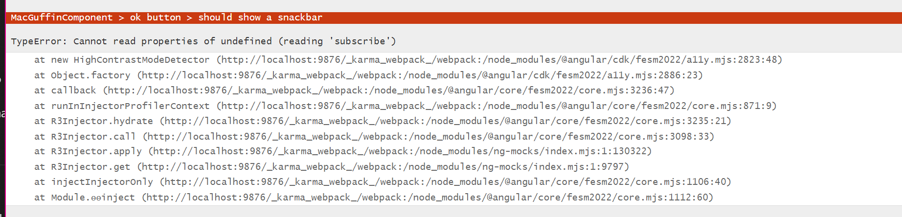

# Using ng-mocks and Material with standalone components

How to get tests on standalone components working with ngMocks and Angular Material (although this is probably helpful for module based Angular apps as well).

## the challenge

[ng-mocks](https://ng-mocks.sudo.eu/guides/component-standalone/) breaks Angular Material [test harnesses](https://material.angular.io/guide/using-component-harnesses) by removing required dependencies.

If a individual material components are kept, in order to use a test harness an error similar to the one below will show:

```bash
TypeError: Cannot read properties of undefined (reading 'subscribe')
    at new HighContrastModeDetector (http://localhost:9876/_karma_webpack_/webpack:/node_modules/@angular/cdk/fesm2022/a11y.mjs:2823:48)
    at Object.factory (http://localhost:9876/_karma_webpack_/webpack:/node_modules/@angular/cdk/fesm2022/a11y.mjs:2886:23)
    at callback (http://localhost:9876/_karma_webpack_/webpack:/node_modules/@angular/core/fesm2022/core.mjs:3236:47)
    at runInInjectorProfilerContext (http://localhost:9876/_karma_webpack_/webpack:/node_modules/@angular/core/fesm2022/core.mjs:871:9)
    at R3Injector.hydrate (http://localhost:9876/_karma_webpack_/webpack:/node_modules/@angular/core/fesm2022/core.mjs:3235:21)
    at R3Injector.call (http://localhost:9876/_karma_webpack_/webpack:/node_modules/@angular/core/fesm2022/core.mjs:3098:33)
    at R3Injector.apply (http://localhost:9876/_karma_webpack_/webpack:/node_modules/ng-mocks/index.mjs:1:130322)
    at R3Injector.get (http://localhost:9876/_karma_webpack_/webpack:/node_modules/ng-mocks/index.mjs:1:9797)
    at injectInjectorOnly (http://localhost:9876/_karma_webpack_/webpack:/node_modules/@angular/core/fesm2022/core.mjs:1106:40)
    at Module.ɵɵinject (http://localhost:9876/_karma_webpack_/webpack:/node_modules/@angular/core/fesm2022/core.mjs:1112:60)
```



See [here](https://github.com/angular/components/issues/25563) for more details on the issue.

## Solution

In order to resolve this issue all Material components used in the component under test, and all material components used in child components have to be explicitly kept (excluded from the auto mocking and removal of dependencies by ng-mocks)

### Basic fix

```TypeScript
 beforeEach(async () => {
    // keep all of the Material modules used by the component AND any child components
    return MockBuilder(AppComponent)
      .beforeCompileComponents((testBed) => {
        testBed.overrideComponent(AppComponent, {
          set: {
            changeDetection: ChangeDetectionStrategy.Default, // onPush doesn't work well with detectChanges()
            providers: [], // clear out the component level providers so the mocks get used
          },
        });
      })
      .keep(CommonModule)
      .keep(NoopAnimationsModule)
      .keep(MatIconModule)
      .keep(MatToolbarModule)
      .keep(MatCardModule)
      .keep(MatSnackBarModule)
      .keep(MatButtonModule);
  });
```

### Better fix

- Add a [test.ts](./src/test.ts) config to always exclude the Angular Material components from being mocked.

```TypeScript
```

- Include the file in **tsconfig.spec.json**

```json
{
  "extends": "./tsconfig.json",
  "compilerOptions": {
    "outDir": "./out-tsc/spec",
    "types": [
      "jasmine"
    ]
  },
  "include": [
    "src/**/*.spec.ts",
    "src/**/*.d.ts",
    "src/test.ts"
  ]
}
```

- Add the **test.ts** file to the test config in angule.json

```json
"test": {
          "builder": "@angular-devkit/build-angular:karma",
          "options": {
            "main": "src/test.ts",
            "polyfills": ["zone.js", "zone.js/testing"],
            "tsConfig": "tsconfig.spec.json",
            "inlineStyleLanguage": "scss",
            "assets": [
              {
                "glob": "**/*",
                "input": "public"
              }
            ],
            "styles": [
              "@angular/material/prebuilt-themes/azure-blue.css",
              "src/styles.scss"
            ],
            "scripts": []
          }
        }
```
